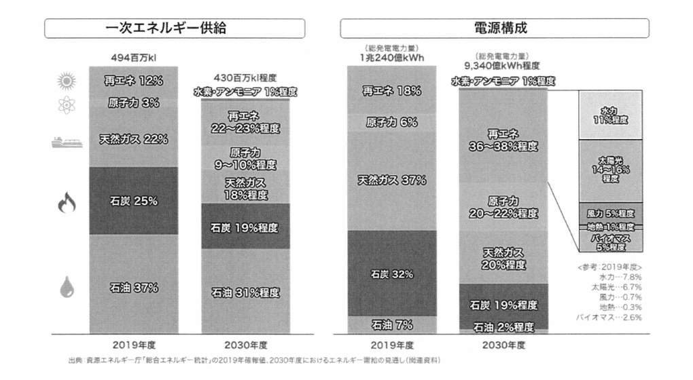

## 問題

Ⅰ　次の2問題（Ⅰ−1，Ⅰ−2）のうち1問題を選び解答せよ。（**解答問題番号**を明記し，答案用紙<u>3枚を用いて</u>まとめよ。）

**Ⅰ−1**　2019年度の日本の一次エネルギーの約8割は化石燃料に依存しており，エネルギー自給率は12%程度である。化石燃料への依存を低くすることでカーボンニュートラルの実現にも貢献することができ，更にはエネルギー安全保障の観点においても，エネルギー自給率を高めることは最重要課題の1つと考えられる。そしてエネルギーの自給率を今後高めていくためには，輸入化石燃料への依存率を現在よりも低くし，下図の資源エネルギー庁から提案されているようなエネルギーミックスを検討することも1つの案と考えられる。

　そこで，地球環境を考えつつ日本の経済活動を今後持続していくためには，エネルギーの入手・確保・輸送・備蓄・転換・利用について検討していくことが必要と考えられる。このような日本を取り巻くエネルギー環境を踏まえたうえで，以下の問いに答えよ。

（1）今後日本におけるエネルギー自給率を上げるため，技術者の立場から考えた場合にどのような課題が考えられるか，多面的な観点から3つ抽出し，それぞれの観点を明確にしたうえで，それぞれの課題内容を示せ。

（2）前問（1）で抽出した課題のうち重要と考える課題を1つ挙げ，その課題に対する解決策を機械技術者として3つ示せ。

（3）前問（2）で示したすべての解決策を実行した結果，得られる成果とその波及効果を分析し，更に新たに生じる懸念事項への機械技術者としての対応策について述べよ。

（4）前問（1）～（3）の業務遂行に当たり，技術者としての倫理，社会の持続可能性の観点から必要となる要件・留意点について題意に即して述べよ。

## 模範解答

### 1. エネルギー自給率向上のための課題（設問(1)）

図に示すとおり、2019年度の一次エネルギー供給は石油37%・石炭25%・天然ガス22%と化石燃料が約8割を占め、自給率は12%程度にとどまる。2030年度見通しでは再エネ22〜23%程度・原子力9〜10%程度への転換が示されており、これを技術的に実現する立場から以下の3課題を抽出する。

#### 1.1 供給側の観点：変動性再生可能エネルギーの主力電源化

電源構成で再エネを36〜38%程度（太陽光14〜16%、風力5%等）へ拡大するには、平地が少なく遠浅海域も限られる国土条件の下で、浮体式洋上風力など日本の自然条件に適合した発電設備を大型化・量産化し、発電コストを既存電源並みに低減することが課題である。太陽光・風力は出力が気象に左右されるため、系統側の調整力確保と一体で検討する必要がある。

#### 1.2 エネルギー転換・貯蔵の観点：余剰電力の貯蔵と水素・アンモニアへの転換

再エネの出力変動と需要の時間的ミスマッチを埋めるため、揚水発電・大容量蓄電池による電力貯蔵に加え、余剰電力を水電解で水素に転換して貯蔵・輸送するPower to Gas技術の確立が課題である。国産再エネ由来の水素・アンモニアは、電源構成1%程度と見込まれる新燃料の国内供給源となり、自給率向上に直結する。

#### 1.3 需要側の観点：徹底した省エネルギーによる需要総量の削減

一次エネルギー供給を494百万klから430百万kl程度へ縮減する見通しの実現には、高効率ヒートポンプ、産業廃熱回収、コージェネレーション、トップランナー制度に基づく機器効率向上など、需要側の省エネ技術で輸入化石燃料の消費量そのものを削減することが課題である。省エネは自給率算定の分母を減らす最も確実な手段である。

### 2. 重要課題と機械技術者としての解決策（設問(2)）

最も重要な課題として1.1の変動性再エネの主力電源化を挙げる。2030年度見通しで最大の構成比拡大（18%→36〜38%）が求められ、国内資源のみで発電できるため自給率への寄与が最も大きいからである。解決策を3つ示す。

(a) 浮体式洋上風力発電システムの開発：定格1万kW級以上の大型風車に対応する浮体構造（スパー型・セミサブ型）の軽量化設計、係留系の疲労信頼性評価、洋上での据付・保守を効率化するSEP船・遠隔監視技術を開発し、量産効果でコストを低減する。

(b) 電力貯蔵設備の高度化：可変速揚水発電による周波数調整能力の拡大、系統用大容量蓄電池の熱管理・安全設計、フライホイール等の機械式貯蔵を組み合わせ、変動を時間スケール別に吸収する。

(c) 水電解装置とP2Gシステムの大容量化：アルカリ水電解・PEM水電解装置の大型化と負荷変動追従運転技術、水素の圧縮・液化・貯蔵タンクなど機械要素の効率・耐久性向上により、余剰再エネを化学エネルギーとして貯蔵する。

### 3. 成果と波及効果の分析、新たな懸念事項への対応策（設問(3)）

上記の解決策により、再エネ比率と自給率（2030年度30%程度）の向上、エネルギー起源CO2の削減（2013年度比46%減目標への貢献）という直接的成果が得られる。波及効果として、風車・浮体・水電解装置の国内サプライチェーン形成による産業競争力と雇用の創出、燃料輸入費の削減、災害時の分散電源によるレジリエンス向上が期待できる。一方で新たな懸念として、①同期発電機の減少による系統慣性の低下と大規模停電リスク、②太陽光パネルや風車ブレード（GFRP）の大量廃棄、③永久磁石用レアアースなど資源制約が生じうる。機械技術者として、①には疑似慣性機能を持つグリッドフォーミングインバータや同期調相機の導入、②には解体・分別を考慮した易リサイクル設計とブレードのリサイクル技術開発、③には省ネオジム・省ジスプロシウム磁石や誘導発電機の採用で対応する。

### 4. 技術者倫理・社会の持続可能性の観点（設問(4)）

倫理面では、公衆の安全・健康・福利を最優先し、洋上風力の建設・保守における労働安全と船舶航行・漁業への影響評価を徹底すること、発電コストやCO2削減効果を誇張せずライフサイクルアセスメント（LCA）に基づき誠実に開示すること、地域住民・漁業者との合意形成に真摯に取り組む説明責任が要件である。持続可能性の面では、エネルギー安定供給（S+3E）と脱炭素の両立を図りつつ、設備のライフサイクル全体での資源循環・環境負荷低減を設計段階から組み込み、将来世代に廃棄物と負担を先送りしない技術開発を進めることに留意する。

## 解説

### 出題趣旨

本問は、エネルギー自給率12%程度という日本の脆弱なエネルギー構造を前提に、資源エネルギー庁が第6次エネルギー基本計画（2021年10月閣議決定）で示した2030年度エネルギーミックス（図）を題材として、自給率向上に機械技術者がどう貢献するかを問うものである。出題された令和5年度（2023年7月）は、2022年のロシアによるウクライナ侵略で燃料価格が高騰し、エネルギー安全保障が国民的関心事となった直後であり、2023年2月には「GX実現に向けた基本方針」が閣議決定されるなど、脱炭素と安定供給の両立（S+3E）が最重要政策課題であった。カーボンニュートラルだけでなく「自給率」を正面から問う点に、この時代背景が色濃く反映されている。

### 答案作成のポイント

第一に、設問(1)は「自給率を上げるため」の課題であることに注意する。単なる脱炭素の課題（例：CCS、火力の高効率化）では題意からずれるため、国産エネルギーの拡大（再エネ、原子力）、輸入燃料に頼らない貯蔵・転換（水素・P2G）、需要削減（省エネ）など、自給率の分子・分母に効く観点で3つを構成する。図の数値（再エネ36〜38%、原子力20〜22%等）を引用すると説得力が増す。第二に、設問(2)は理由の明示は求められていないが選定理由を一言述べたうえで、「機械技術者として」3つの解決策を挙げることが要求されており、政策論ではなく風車・蓄エネ・水電解などの具体的な機械技術で書く。第三に、設問(3)は他年度と異なり「成果と波及効果の分析」が先に要求される点が特徴で、成果→波及効果→新たな懸念→対応策の4段構成で漏れなく書く。系統慣性低下や太陽光パネル廃棄などは白書等でも指摘される定番の懸念であり書きやすい。設問(4)は倫理（安全最優先・誠実な情報開示・合意形成）と持続可能性（LCA・資源循環）の両方に必ず触れる。

### 背景知識

第6次エネルギー基本計画は、2050年カーボンニュートラルと2030年度温室効果ガス46%削減（2013年度比）に向け、電源構成で再エネ36〜38%、原子力20〜22%、水素・アンモニア1%、火力41%程度を掲げ、実現すれば自給率は30%程度に向上するとされる。洋上風力は「再エネ海域利用法」に基づく促進区域指定が進み、NEDOのグリーンイノベーション基金で浮体式の技術開発が推進されている。水素についても2023年6月に水素基本戦略が改定され、水電解装置の国内導入・海外展開の目標が示された。エネルギー白書2023は、ウクライナ危機後の国際エネルギー情勢と日本の自給率（2021年度13%程度）を詳述しており、本問の背景資料として最適である。

### 出典・参考文献

- 第6次エネルギー基本計画（資源エネルギー庁、2021年10月閣議決定） https://www.enecho.meti.go.jp/category/others/basic_plan/
- 令和4年度エネルギーに関する年次報告（エネルギー白書2023）（資源エネルギー庁、2023年6月） https://www.enecho.meti.go.jp/about/whitepaper/2023/
- エネルギー白書2023 第1部第3章第2節「GXの実現に向けた日本の対応」（資源エネルギー庁） https://www.enecho.meti.go.jp/about/whitepaper/2023/html/1-3-2.html
- 第6次エネルギー基本計画の概要（資源エネルギー庁説明資料） https://hokkaido.env.go.jp/content/900134314.pdf
- グリーンイノベーション基金事業（洋上風力発電の低コスト化ほか）（NEDO） https://green-innovation.nedo.go.jp/
- 技術士倫理綱領（公益社団法人 日本技術士会、2023年3月改定） https://www.engineer.or.jp/c_topics/009/009289.html
