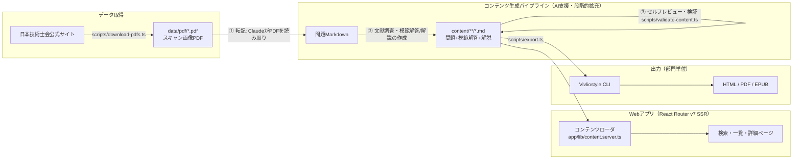
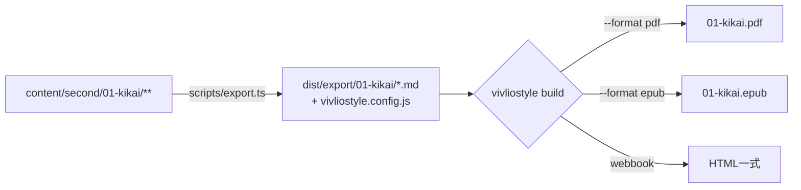

# 技術士過去問題模範解答解説集　設計ドキュメント

[SPEC.md](./SPEC.md) の要件定義に基づく設計。

## 1. 全体アーキテクチャ



- **問題PDFはスキャン画像**（フォント情報なし・600dpi）のため、機械的なテキスト抽出は不可。
  転記は Claude が PDF を直接読み取って行う（①）。模範解答・解説の生成（②）と同じ AI パイプラインの一部とする。
- コンテンツは **Markdown ファイルとしてリポジトリに直接保存**（DB なし）。アプリは SSR 時にこれを読み込む。

## 2. ディレクトリ構成

```txt
pe-past-exam/
├── app/                        # React Router v7 アプリ本体
│   ├── routes/                 # ルート（一覧・検索・詳細）
│   ├── lib/
│   │   ├── content.server.ts   # コンテンツローダ（Markdown→構造化データ）
│   │   ├── search.ts           # 検索・絞り込みロジック（純粋関数）
│   │   └── taxonomy.ts         # 部門・科目・年度の定義
│   ├── root.tsx
│   └── app.css
├── content/                    # コンテンツMarkdown（本体データ）
│   └── second/01-kikai/r07/hisshu/I-1.md   など
├── data/pdf/                   # ダウンロードした過去問PDF（成果物）
│   └── second/01-kikai/*.pdf + sources.json
├── scripts/                    # パイプラインスクリプト
│   ├── download-pdfs.ts        # 公式サイトからPDF取得
│   ├── new-question.ts         # 問題Markdownの雛形生成
│   ├── validate-content.ts     # frontmatter/構成の検証
│   └── export.ts               # Vivliostyle用ビルド（html/pdf/epub）
├── docs/                       # SPEC.md / DESIGN.md / PIPELINE.md
├── tests/                      # bun test ユニットテスト
├── Containerfile / compose.yaml
├── Makefile / README.md
└── package.json / biome.json / tsconfig.json / react-router.config.ts
```

## 3. コンテンツデータモデル

**1問題 = 1 Markdown ファイル**。パスは `content/{exam}/{division}/{year}/{subject}/{questionNo}.md`。

| 軸 | コード例 | 備考 |
| --- | --- | --- |
| exam | `second` / `first` | 第二次試験 / 第一次試験 |
| division | `01-kikai` | 部門コード+スラッグ |
| year | `r01`〜`r07`, `h23`〜 | 和暦コード |
| subject | `hisshu` / `0103` | 必須科目 / 選択科目コード |
| questionNo | `I-1`, `II-1-3`, `III-2` | 問題番号（ローマ数字は半角英字で表現） |

### frontmatter スキーマ

```yaml
---
id: second-01-r07-hisshu-I-1          # パスから一意に決まるID
exam: second
examLabel: 技術士第二次試験
division: "01"
divisionLabel: 機械部門
subject: hisshu                        # hisshu | 選択科目コード(例 "0103")
subjectLabel: 必須科目Ⅰ
year: r07
yearLabel: 令和7年度
questionNo: Ⅰ−1
title: <問題の要旨を表す短いタイトル>
tags: [キーワード, ...]                # 検索用
sourcePdf: data/pdf/second/01-kikai/r07_hisshu.pdf
status: draft                          # draft | transcribed | answered | reviewed
---
```

### 本文構成（SPEC「記載の順序」準拠）

小問なしの問題:

```markdown
## 問題
（問題文の忠実な転記。図表は Mermaid / LaTeX 数式で再現、困難な場合は PDF から切り出した画像を参照）

## 模範解答
（二次試験は記述式論文。指定文字数(600〜1800字)相当の答案）

## 解説
（概ね1ページ。出題趣旨、答案のポイント、背景知識）

### 出典・参考文献
- （調査に用いた信頼できる文献・Webページを明記）
```

小問（（1）〜（n））のある問題は、設問ごとに「問題文 → 模範解答 → 解説」を連続して記載する:

```markdown
## 問題
（共通リード文・本文のみ）

## 設問（1）
（小問(1)の問題文の忠実な転記）

### 模範解答
（設問(1)に対応する答案）

### 解説
（設問(1)固有の解説。無ければ省略可）

## 設問（2）
（以下同様に設問の数だけ繰り返し）

## 全体解説
（全設問にわたる解説: 出題趣旨、背景知識など）

### 出典・参考文献
- （調査に用いた信頼できる文献・Webページを明記）
```

`status` はパイプラインの進捗管理を兼ねる: `draft`(雛形) → `transcribed`(問題転記済) → `answered`(模範解答・解説作成済) → `reviewed`(セルフレビュー済)。

## 4. Webアプリ（React Router v7 Framework mode / SSR）

### ルーティング

| パス | 内容 |
| --- | --- |
| `/` | トップ。試験種別→部門→年度のナビゲーション |
| `/questions` | 一覧+検索・絞り込み（クエリパラメータ: `division` / `year` / `subject` / `q`） |
| `/questions/:id` | 問題詳細（問題→模範解答→解説。小問ありは設問ごとに問題→模範解答→解説） |

### コンテンツローダ

- `app/lib/content.server.ts` が起動時（初回アクセス時）に `content/` を走査し、frontmatter をパースしてインメモリのインデックスを構築する。開発時はファイル変更で再読込。
- Markdown → HTML 変換はサーバー側で行う（`marked` + 数式は KaTeX、図は Mermaid をクライアントでレンダリング）。
- コンテンツ規模は最終形でも数万件以下のテキストであり、インメモリ検索で十分。DB は導入しない。

### 検索・絞り込み

- 部門・年度・科目: frontmatter によるフィルタ。
- キーワード: タイトル・タグ・本文の部分一致（正規化: 全角/半角・大文字/小文字）。
- ロジックは `app/lib/search.ts` に純粋関数として実装し、ユニットテスト対象とする。

## 5. 出力パイプライン（部門単位の HTML / PDF / EPUB）



- `scripts/export.ts` が部門を引数に取り、年度→科目→問題番号順に Markdown を束ねた出版物ソースと `vivliostyle.config.js` を `dist/export/` に生成する（`build/` は react-router build が上書きするため使用しない）。
- Vivliostyle CLI で PDF / EPUB / HTML(webbook) を生成（`vivliostyle build --format pdf|epub|webpub`）。
- 印刷用スタイルは `@vivliostyle/theme-techbook` をベースにカスタム CSS を当てる。

## 6. コンテンツ生成パイプライン（詳細は docs/PIPELINE.md）

1. **取得**: `scripts/download-pdfs.ts` — 公式ページから対象PDFをダウンロードし `sources.json` に出典を記録。
2. **雛形生成**: `scripts/new-question.ts` — 年度・科目・問題番号を指定して frontmatter 付き雛形を生成（`status: draft`）。
3. **転記**: Claude が PDF を読み取り「## 問題」を忠実に転記（`status: transcribed`）。図表は Mermaid/LaTeX 優先、困難なら PDF から画像を切り出し `content/**/images/` に保存。
4. **模範解答・解説の作成**: 複数の信頼できる文献に当たって作成し、出典を明記（`status: answered`）。
5. **セルフレビュー**: 品質基準（分量・出典明示・複数文献）を確認（`status: reviewed`）。
6. **検証**: `scripts/validate-content.ts` — frontmatter 必須項目・セクション構成・status を機械チェック。CI でも実行。

## 7. テスト・品質管理

- **Typecheck**: `tsc --noEmit`（`bun run typecheck`）
- **Lint/Format**: Biome（`bun run lint`）
- **Unit test**: `bun test` — 検索ロジック、コンテンツローダ、validate スクリプトを対象
- **コンテンツ検証**: `bun run validate` を CI に組み込み

## 8. コンテナ・デプロイ

- ローカル: `Containerfile`（マルチステージ、`oven/bun` ベース）+ `compose.yaml` を Podman で使用。
- 本番デプロイ（TODO・今後実装）: GCP Cloud Run。**非公開・私的利用の方針のため、公開時は Cloud Run の IAM 認証（`--no-allow-unauthenticated`）または IAP を必須とする。**
- CI/CD（TODO・今後実装）: GitHub Actions で typecheck / test / validate を PR 時に実行し、main マージで Cloud Run へデプロイ（Workload Identity Federation 認証）。

## 9. 著作権上の取り扱い

- 過去問題の著作権は日本技術士会に帰属する。本システムは**非公開・私的利用**に限定する（SPEC 準拠）。
- 生成した PDF/EPUB も同様に私的利用の範囲で扱う。
- 模範解答・解説は本プロジェクトのオリジナル著作物であり、参照文献は出典を明記する。
