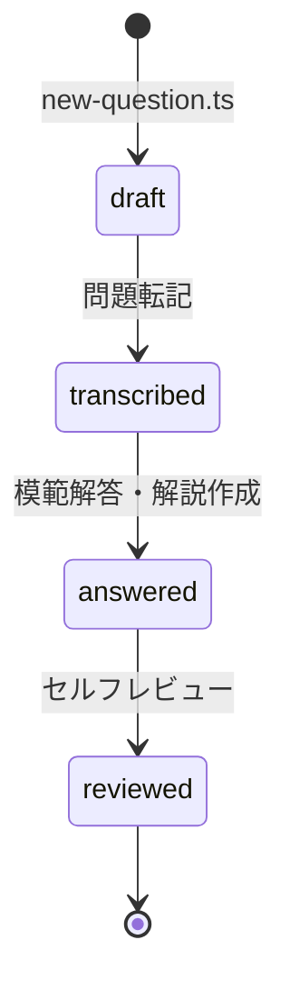

# コンテンツ生成パイプライン

過去問題の取得からコンテンツ公開までの手順。全体像は [DESIGN.md](./DESIGN.md) の第6章を参照。

## 前提

- 問題PDFはスキャン画像（フォント情報なし）のため、OCRではなく **Claude が PDF を直接読み取って転記** する。
- 模範解答・解説の作成も Claude（Claude Code セッション）で行い、人がレビューする。

## 手順

### 1. PDF の取得

```sh
bun run scripts/download-pdfs.ts
```

- `data/pdf/<exam>/<division>/sources.json` に記載された PDF を一括取得する（既存はスキップ、1秒間隔）。
- 対象範囲を広げるときは、公式ページから URL を調べて `sources.json` に追記する。
  - 第二次試験: <https://www.engineer.or.jp/c_categories/index02022.html>
  - 第一次試験: <https://www.engineer.or.jp/c_categories/index02021.html>

### 2. 雛形の生成

```sh
bun run scripts/new-question.ts second 01 r07 hisshu I-1
bun run scripts/new-question.ts second 01 r07 0103 II-1-1
```

frontmatter 付きの雛形が `content/` 配下に作成される（`status: draft`）。

### 3. 問題文の転記（Claude）

Claude Code に以下を依頼する:

> data/pdf/second/01-kikai/r07_hisshu.pdf を読んで、content/second/01-kikai/r07/hisshu/I-1.md の「## 問題」セクションに問題文を忠実に転記してください。
>
> - 原文の表記（漢字・かな・句読点・箇条書き番号）を保つこと
> - 小問（（1）〜（n））がある場合は、共通リード文のみを「## 問題」に残し、各小問の問題文は「## 設問（n）」セクションへ原文のまま転記すること。このとき各設問の直下に「### 模範解答」（本文は TODO）を置き、雛形の「## 模範解答」「## 解説」は「## 全体解説」（本文は TODO）に置き換えて、後工程が書き込む骨組みまで作ること
> - 数式は LaTeX（$...$ / $$...$$）、図表は Mermaid か Markdown テーブルで再現すること
> - 再現困難な図・写真は `pdftoppm` などで PDF から画像を切り出して `content/**/images/` に保存し、相対パスで参照すること
> - 転記が終わったら frontmatter の title・tags を設定し、status を transcribed にすること

### 4. 模範解答・解説の作成（Claude）

> content/second/01-kikai/r07/hisshu/I-1.md に模範解答と解説を書いてください。
>
> - 模範解答は本試験の答案形式（指定文字数相当の記述式論文）とすること
> - 小問がある場合は、各「## 設問（n）」の直下に「### 模範解答」と（設問固有の解説があれば）「### 解説」を続けて記載すること
> - 全設問にわたる解説（出題趣旨・背景知識など）は末尾の「## 全体解説」にまとめること（小問なしの場合は従来どおり「## 解説」）
> - 最新の情報を信頼できる Web ページ・論文・白書等で調査し、「### 出典・参考文献」に明記すること
> - 解説は全体で概ね1ページ（出題趣旨 → 答案のポイント → 背景知識）とすること
> - 完了したら status を answered にすること

### 5. セルフレビュー

品質基準（[SPEC.md](./SPEC.md)）を満たすことを確認し、`status: reviewed` にする:

- [ ] 問題文が原文PDFと一致している
- [ ] 小問がある場合、設問ごとに「問題 → 模範解答 → 解説」が連続して記載されている（全体にわたる解説は「## 全体解説」）
- [ ] 模範解答が指定文字数・答案形式に沿っている
- [ ] 解説が概ね1ページに収まっている
- [ ] 複数の文献にあたり、出典が明記されている

### 6. 機械検証

```sh
bun run validate
```

frontmatter 必須項目・id とパスの整合・セクション構成・status を検証する。CI でも実行する（TODO）。

## status の遷移


